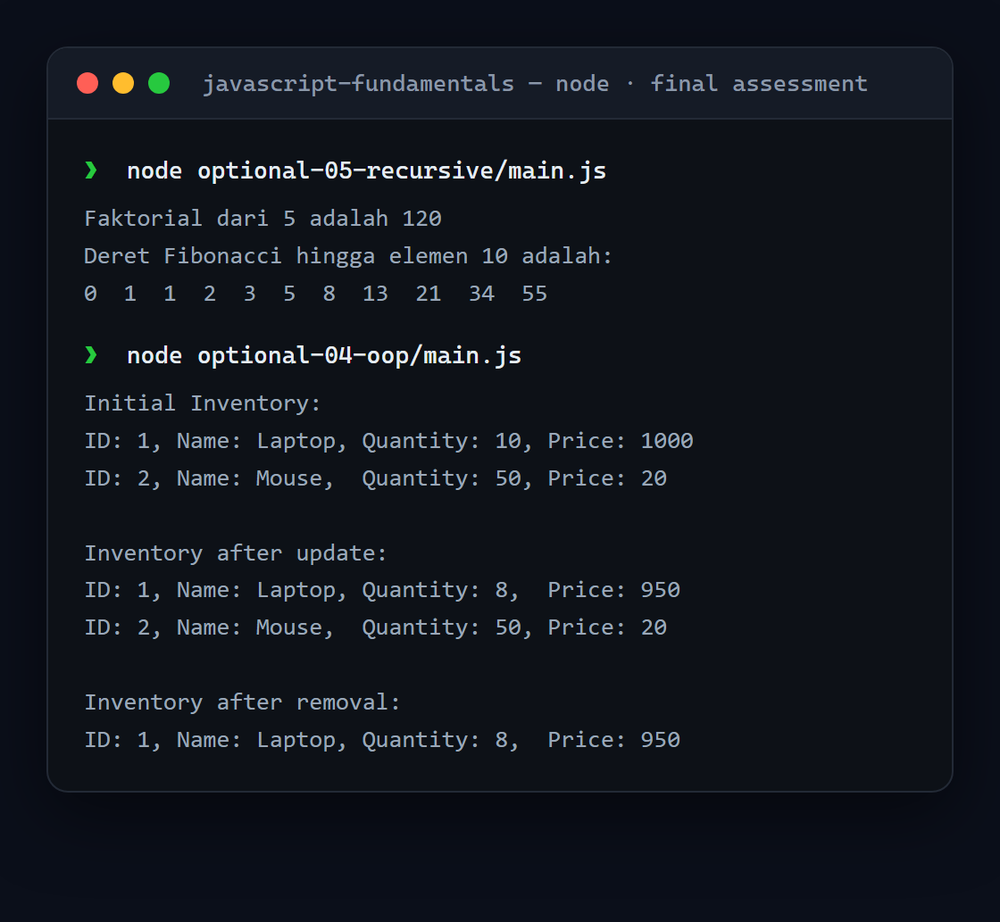

# JavaScript Fundamentals

A collection of exercises from the final assessment of Dicoding's *Belajar Dasar Pemrograman JavaScript* — covering clean code, testing, OOP, and recursion.

<p align="center">
  
</p>

## Exercises

| # | Topic |
|---|---|
| 01 | Writing comments |
| 02 | Code style |
| 03 | Writing tests |
| 04 | Object-oriented programming (Inventory / Item) |
| 05 | Recursion (factorial, Fibonacci) |
| 06 | Full-coverage testing |
| 07 | Real-world scenario (order processing) |

## Run it

```bash
cd final-assessment/optional-05-recursive
node main.js
# exercises with tests:  npm install && npm test
```

## Tech stack

Node.js · Jest (for the testing exercises)

## Notes

Final-assessment submission for Dicoding's *Belajar Dasar Pemrograman JavaScript*. Each folder has its own `instruksi.md` describing the task.
